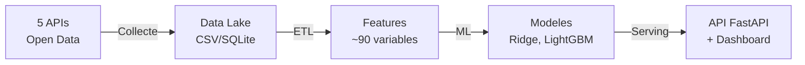

# HVAC Market Analysis — France metropolitaine


**Analyse predictive du marche HVAC (chauffage, ventilation, climatisation) sur les 96 departements metropolitains francais par croisement de donnees energetiques, meteorologiques et economiques.**

> Projet portfolio Data Science — Pipeline complet de la collecte a la prediction ML avec API REST, dashboard interactif, deploiement Docker et orchestration Airflow.

---

## Acces rapide

| Ressource | Lien |
|-----------|------|
| **API REST** (Swagger) | `http://localhost:8000/docs` |
| **Dashboard** | `http://localhost:8501` |
| **Donnees pCloud** | [Telecharger](https://e.pcloud.link/publink/show?code=kZbQQ3Zg1slD5WfRgh42fH5rRpDDYWyBEsy) |
| **Documentation** | [`docs/`](docs/) |

---

## Vue d'ensemble

Ce projet construit un **pipeline data de bout en bout** pour analyser et predire les installations d'equipements HVAC (pompes a chaleur, climatisation) dans les **96 departements** metropolitains :



### Resultats cles

| Metrique | Valeur |
|----------|--------|
| Couverture geographique | 96 departements (France metro.) |
| Periode | 2019 - 2025 |
| Meilleur modele | Ridge (R2 test = 0.989, RMSE = 0.93) |
| Modeles entraines | Ridge, LightGBM, Ridge exogenes, Prophet, LSTM |
| Tests unitaires | 119 tests |
| Dashboard | Streamlit (6 pages interactives) |
| API | FastAPI (6 endpoints, Swagger auto) |

---

## Demarrage rapide

### Option 1 — Docker (recommande)

```bash
git clone https://github.com/PDUCLOS/Projet-HVAC.git
cd Projet-HVAC

# Lancer avec donnees de demo
docker compose run --rm pipeline demo
docker compose up

# API :       http://localhost:8000/docs
# Dashboard : http://localhost:8501
```

### Option 2 — One-click local

```bash
git clone https://github.com/PDUCLOS/Projet-HVAC.git
cd Projet-HVAC
chmod +x deploy.sh && ./deploy.sh
```

### Option 3 — Make

```bash
make install       # Creer venv + installer dependances
make demo          # Generer les donnees de demo
make pipeline      # Executer le pipeline complet
make dashboard     # Lancer le dashboard Streamlit
```

### Option 4 — Manuel

```bash
python -m venv venv && source venv/bin/activate
pip install -r requirements.txt
cp .env.example .env
python scripts/generate_demo_data.py
python -m src.pipeline process
python -m src.pipeline train
python -m src.pipeline evaluate
streamlit run app/app.py
```

---

## Architecture technique

```
Projet-HVAC/
├── config/settings.py              # Configuration centralisee (96 departements)
├── src/
│   ├── pipeline.py                 # Orchestrateur CLI (16 commandes)
│   ├── collectors/                 # Collecte (architecture plugin)
│   │   ├── base.py                 # BaseCollector + Registry
│   │   ├── weather.py              # Open-Meteo (96 prefectures)
│   │   ├── insee.py                # INSEE BDM (SDMX)
│   │   ├── eurostat_col.py         # Eurostat IPI
│   │   ├── sitadel.py              # Permis de construire
│   │   ├── dpe.py                  # DPE ADEME
│   │   └── pcloud_sync.py          # Synchronisation pCloud
│   ├── processing/                 # Traitement des donnees
│   │   ├── clean_data.py           # Nettoyage par source
│   │   ├── merge_datasets.py       # Fusion multi-sources
│   │   ├── feature_engineering.py  # ~90 features ML
│   │   └── outlier_detection.py    # IQR + Z-score + Isolation Forest
│   ├── models/                     # Modelisation
│   │   ├── baseline.py             # Ridge, LightGBM, Prophet
│   │   ├── deep_learning.py        # LSTM (PyTorch)
│   │   ├── train.py                # Orchestrateur d'entrainement
│   │   ├── evaluate.py             # Metriques, SHAP, visualisations
│   │   └── reinforcement_learning_demo.py  # Demo RL (Gymnasium)
│   ├── analysis/                   # EDA + correlations
│   └── database/                   # Schema en etoile, SQLAlchemy
├── api/                            # API REST FastAPI
│   ├── main.py                     # Endpoints (health, predict, metrics)
│   ├── models.py                   # Schemas Pydantic
│   └── dependencies.py             # Chargement modeles, config
├── app/                            # Dashboard Streamlit (6 pages)
├── airflow/dags/                   # DAG Airflow (orchestration)
├── kubernetes/                     # Manifests K8s (Deployment, Service, Ingress)
├── docs/                           # Documentation formation
│   ├── DATA_GOVERNANCE.md          # Module 1 : Gouvernance, RGPD, AI Act
│   ├── DATABASE_ARCHITECTURE.md    # Module 3 : Schema etoile, OLAP, NoSQL
│   └── DATA_PIPELINE.md            # Module 4 : ETL, monitoring, Airbyte
├── scripts/                        # Scripts utilitaires
├── tests/                          # 119 tests (pytest)
├── Dockerfile                      # Build multi-stage
├── docker-compose.yml              # API + Dashboard + PostgreSQL
├── Makefile                        # Commandes raccourcies
├── deploy.sh                       # Deploiement one-click
├── render.yaml                     # Config Render.com
└── requirements.txt                # Dependances (toutes bornees)
```

---

## API REST (FastAPI)

```bash
# Lancer l'API
pip install -r requirements-api.txt
uvicorn api.main:app --reload

# Documentation Swagger : http://localhost:8000/docs
```

| Endpoint | Methode | Description |
|----------|---------|-------------|
| `/health` | GET | Statut de l'API, version, info modele |
| `/predictions` | GET | Predictions par departement et horizon |
| `/predict` | POST | Prediction custom avec parametres JSON |
| `/data/summary` | GET | Resume des donnees disponibles |
| `/model/metrics` | GET | Metriques ML (RMSE, MAE, R2, MAPE) |
| `/departments` | GET | Liste des 96 departements |

Exemple :
```bash
# Predictions pour le Rhone sur 6 mois
curl "http://localhost:8000/predictions?departement=69&horizon=6"

# Metriques du modele
curl "http://localhost:8000/model/metrics"
```

---

## Dashboard Streamlit

```bash
streamlit run app/app.py
```

| Page | Description |
|------|-------------|
| **Accueil** | Vue d'ensemble, metriques, architecture du pipeline |
| **Exploration** | Exploration interactive (stats, distributions, correlations) |
| **Carte de France** | Carte interactive des 96 departements |
| **Predictions ML** | Predictions vs realite, residus, feature importance |
| **Comparaison modeles** | Tableau comparatif, radar chart |
| **Pipeline** | Etat des donnees, lancement pipeline, pCloud sync |

---

## Commandes CLI

```bash
# Collecte
python -m src.pipeline collect                        # Toutes les sources
python -m src.pipeline collect --sources weather,insee # Sources specifiques

# Traitement
python -m src.pipeline process                        # clean+merge+features+outliers

# Machine Learning
python -m src.pipeline train                          # Entrainer
python -m src.pipeline evaluate                       # Evaluer

# Tout-en-un
python -m src.pipeline update_all                     # Collect + process + train + upload
```

---

## Docker

```bash
# Build
docker build -t hvac-market .

# Run (API + Dashboard)
docker compose up

# Avec PostgreSQL
docker compose --profile db up

# Pipeline seul
docker compose run --rm pipeline
```

---

## Couverture formation Data Science Lead

Ce projet couvre les 6 modules de la formation certifiante Bac+5 :

| Module | Sujet | Implementation |
|--------|-------|----------------|
| **M1** | Data Governance | [`docs/DATA_GOVERNANCE.md`](docs/DATA_GOVERNANCE.md) — RGPD, AI Act, lignage, maturite data |
| **M2** | Deploiement & ML Distribue | `Dockerfile`, `docker-compose.yml`, `kubernetes/`, `render.yaml` |
| **M3** | Architecture BDD | [`docs/DATABASE_ARCHITECTURE.md`](docs/DATABASE_ARCHITECTURE.md) — Schema etoile, OLAP, MongoDB |
| **M4** | Data Pipelines | [`docs/DATA_PIPELINE.md`](docs/DATA_PIPELINE.md) — ETL, Airbyte, monitoring |
| **M5** | Automation & Workflow | [`airflow/dags/hvac_pipeline_dag.py`](airflow/dags/hvac_pipeline_dag.py) — DAG Airflow |
| **M6** | Reinforcement Learning | [`src/models/reinforcement_learning_demo.py`](src/models/reinforcement_learning_demo.py) — Gymnasium, Q-Learning |

---

## Sources de donnees

| Source | API | Couverture | Donnees |
|--------|-----|-----------|---------|
| **DPE ADEME** | data.ademe.fr | 96 departements | Diagnostics energetiques |
| **Open-Meteo** | archive-api.open-meteo.com | 96 prefectures, 7 ans | Temperature, precipitations, HDD/CDD |
| **INSEE** | bdm.insee.fr (SDMX) | France, mensuel | Indicateurs economiques |
| **Eurostat** | package `eurostat` | France, mensuel | IPI HVAC |
| **SITADEL** | DiDo API (SDES) | 96 departements | Permis de construire |

> Toutes les sources sont **Open Data** — aucune cle API requise.

---

## Resultats ML

```
Modele             Val RMSE   Val R2    Test RMSE   Test R2
ridge              1.178      0.9798    0.929       0.9885
lightgbm           1.456      0.9691    1.283       0.9781
ridge_exogenes     1.535      0.9657    1.339       0.9762
```

Top features : `nb_installations_pac_lag_1m`, `nb_installations_pac_diff_1m`, `nb_dpe_total_rmean_3m`, `temp_mean_rmean_6m`, `hdd_sum_rmean_6m`

---

## Stack technique

| Categorie | Technologies |
|-----------|-------------|
| **Langage** | Python 3.10+ |
| **Data** | pandas, numpy, SQLAlchemy |
| **ML** | scikit-learn, LightGBM, XGBoost, Prophet, SHAP |
| **Deep Learning** | PyTorch (LSTM), Gymnasium (RL) |
| **API** | FastAPI, Pydantic, uvicorn |
| **Dashboard** | Streamlit, Plotly |
| **BDD** | SQLite, PostgreSQL, SQL Server |
| **DevOps** | Docker, Kubernetes, Airflow, Makefile |
| **Cloud** | pCloud (sync), Render.com (deploy) |

---

## Tests

```bash
python -m pytest tests/ -v                              # 119 tests
python -m pytest tests/ -v --cov=src --cov-report=term  # Avec couverture
```

---

## Auteur

**Patrice DUCLOS** — Data Analyst Senior (20 ans d'experience)

Projet portfolio pour candidature a la formation **Data Science Lead** (Jedha Bootcamp, certification Bac+5 RNCP Niveau 7).

---

## Licence

[MIT](LICENSE) — Ce projet est open source.
