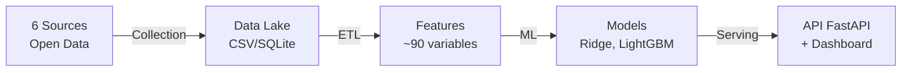

# HVAC Market Analysis — Metropolitan France


**Predictive analysis of the HVAC market (heating, ventilation, air conditioning) across 96 metropolitan French departments by cross-referencing energy, weather, and economic data.**

> Data Science portfolio project — Complete pipeline from data collection to ML prediction with REST API, interactive dashboard, Docker deployment, and Airflow orchestration.

---

## Quick Access

| Resource | Link |
|-----------|------|
| **API REST** (Swagger) | `http://localhost:8000/docs` |
| **Dashboard** | `http://localhost:8501` |
| **pCloud Data** | [Download](https://e.pcloud.link/publink/show?code=kZbQQ3Zg1slD5WfRgh42fH5rRpDDYWyBEsy) |
| **Documentation** | [`docs/`](docs/) |

---

## Overview

This project builds an **end-to-end data pipeline** to analyze and predict HVAC equipment installations (heat pumps, air conditioning) across **96 metropolitan departments**:



### Key Results

| Metric | Value |
|----------|--------|
| Geographic coverage | 96 departments (Metropolitan France) |
| Period | 2019 - 2025 |
| Best model | Ridge (R2 test = 0.989, RMSE = 0.93) |
| Trained models | Ridge, LightGBM, Ridge exogenous, Prophet, LSTM |
| Unit tests | 114 tests |
| Dashboard | Streamlit (6 interactive pages) |
| API | FastAPI (6 endpoints, auto Swagger) |

---

## Quick Start

### Option 1 — Docker (recommended)

```bash
git clone https://github.com/PDUCLOS/Projet-HVAC.git
cd Projet-HVAC

# Launch with demo data
docker compose run --rm pipeline demo
docker compose up

# API :       http://localhost:8000/docs
# Dashboard : http://localhost:8501
```

### Option 2 — One-click local

```bash
git clone https://github.com/PDUCLOS/Projet-HVAC.git
cd Projet-HVAC
chmod +x deploy.sh && ./deploy.sh
```

### Option 3 — Make

```bash
make install       # Create venv + install dependencies
make demo          # Generate demo data
make pipeline      # Run the full pipeline
make dashboard     # Launch the Streamlit dashboard
```

### Option 4 — Manual

```bash
python -m venv venv && source venv/bin/activate
pip install -r requirements.txt
cp .env.example .env
python scripts/generate_demo_data.py
python -m src.pipeline process
python -m src.pipeline train
python -m src.pipeline evaluate
streamlit run app/app.py
```

---

## Technical Architecture

```
Projet-HVAC/
├── config/settings.py              # Centralized configuration (96 departments, names, coordinates)
├── src/
│   ├── pipeline.py                 # CLI orchestrator (16 commands, interactive mode)
│   ├── collectors/                 # Collection (plugin architecture)
│   │   ├── base.py                 # BaseCollector + Registry
│   │   ├── weather.py              # Open-Meteo (96 prefectures)
│   │   ├── insee.py                # INSEE BDM (SDMX)
│   │   ├── eurostat_col.py         # Eurostat IPI
│   │   ├── sitadel.py              # Building permits
│   │   ├── dpe.py                  # DPE ADEME
│   │   └── pcloud_sync.py          # pCloud synchronization (data + features)
│   ├── processing/                 # Data processing
│   │   ├── clean_data.py           # Cleaning by source (with skip rules + preview)
│   │   ├── merge_datasets.py       # Multi-source merging (DPE + weather + SITADEL + INSEE ref)
│   │   ├── feature_engineering.py  # ~90 ML features
│   │   └── outlier_detection.py    # IQR + Z-score + Isolation Forest
│   ├── models/                     # Modeling
│   │   ├── baseline.py             # Ridge, LightGBM, Prophet
│   │   ├── deep_learning.py        # LSTM (PyTorch)
│   │   ├── train.py                # Training orchestrator
│   │   ├── evaluate.py             # Metrics, SHAP, visualizations
│   │   └── reinforcement_learning_demo.py  # RL demo (Gymnasium)
│   ├── analysis/                   # EDA + correlations
│   └── database/                   # Star schema, SQLAlchemy (interactive import)
├── api/                            # REST API FastAPI
│   ├── main.py                     # Endpoints (health, predict, metrics)
│   ├── models.py                   # Pydantic schemas
│   └── dependencies.py             # Model loading, config
├── app/                            # Streamlit dashboard (6 pages)
├── airflow/dags/                   # Airflow DAG (orchestration)
├── kubernetes/                     # K8s manifests (Deployment, Service, Ingress)
├── docs/                           # Training documentation
│   ├── DATA_GOVERNANCE.md          # Module 1: Governance, GDPR, AI Act
│   ├── DATABASE_ARCHITECTURE.md    # Module 3: Star schema, OLAP, NoSQL
│   └── DATA_PIPELINE.md            # Module 4: ETL, monitoring, Airbyte
├── scripts/                        # Utility scripts
├── tests/                          # 114 tests (pytest)
├── Dockerfile                      # Multi-stage build
├── docker-compose.yml              # API + Dashboard + PostgreSQL
├── Makefile                        # Shortcut commands
├── deploy.sh                       # One-click deployment
├── render.yaml                     # Render.com config
└── requirements.txt                # Dependencies (all pinned)
```

---

## API REST (FastAPI)

```bash
# Launch the API
pip install -r requirements-api.txt
uvicorn api.main:app --reload

# Swagger documentation: http://localhost:8000/docs
```

| Endpoint | Method | Description |
|----------|---------|-------------|
| `/health` | GET | API status, version, model info |
| `/predictions` | GET | Predictions by department and horizon |
| `/predict` | POST | Custom prediction with JSON parameters |
| `/data/summary` | GET | Summary of available data |
| `/model/metrics` | GET | ML metrics (RMSE, MAE, R2, MAPE) |
| `/departments` | GET | List of the 96 departments |

Example:
```bash
# Predictions for the Rhone department over 6 months
curl "http://localhost:8000/predictions?departement=69&horizon=6"

# Model metrics
curl "http://localhost:8000/model/metrics"
```

---

## Dashboard Streamlit

```bash
streamlit run app/app.py
```

| Page | Description |
|------|-------------|
| **Home** | Overview, key metrics, data insights (Top 10 PAC, trends), model performance, architecture |
| **Exploration** | Interactive exploration (stats, distributions, correlations) |
| **Map of France** | Interactive map with metric selector (PAC, DPE, income, price/m²), department ranking, regional stats |
| **ML Predictions** | Predictions vs actual, residuals, feature importance |
| **Model Comparison** | Comparison table, radar chart |
| **Pipeline** | Data status, pipeline launch, pCloud sync |

---

## CLI Commands

```bash
# Collection
python -m src.pipeline collect                        # All sources
python -m src.pipeline collect --sources weather,insee # Specific sources

# Processing
python -m src.pipeline process                        # clean+merge+features+outliers
python -m src.pipeline clean                          # Cleaning only
python -m src.pipeline merge                          # Merge only
python -m src.pipeline features                       # Feature engineering only

# Interactive mode (preview impact before applying)
python -m src.pipeline clean -i                       # Interactive cleaning: preview & skip rules
python -m src.pipeline process -i                     # Interactive processing (clean step)
python -m src.pipeline import_data -i                 # Interactive import: choose sources to load

# Machine Learning
python -m src.pipeline train                          # Train
python -m src.pipeline evaluate                       # Evaluate

# Database
python -m src.pipeline init_db                        # Initialize database schema
python -m src.pipeline import_data                    # Import CSV → database

# All-in-one
python -m src.pipeline update_all                     # Collect + process + train + upload

# pCloud sync
python -m src.pipeline upload_pcloud                  # Upload results to pCloud
```

### Interactive Mode (`-i` / `--interactive`)

The pipeline supports an interactive mode for data cleaning and import, useful when data is expensive to re-collect:

- **Cleaning**: Preview the impact of each cleaning rule (rows affected) before applying. Skip rules you want to preserve (e.g., keep outliers for analysis).
- **Import**: Select which data sources to load into the database. View file sizes, row counts, and last-modified dates before importing.

---

## Docker

```bash
# Build
docker build -t hvac-market .

# Run (API + Dashboard)
docker compose up

# With PostgreSQL
docker compose --profile db up

# Pipeline only
docker compose run --rm pipeline
```

---

## Data Science Lead Training Coverage

This project covers the 6 modules of the Bac+5 certification:

| Module | Subject | Implementation |
|--------|---------|----------------|
| **M1** | Data Governance | [`docs/DATA_GOVERNANCE.md`](docs/DATA_GOVERNANCE.md) — GDPR, AI Act, lineage, data maturity |
| **M2** | Deployment & Distributed ML | `Dockerfile`, `docker-compose.yml`, `kubernetes/`, `render.yaml` |
| **M3** | Database Architecture | [`docs/DATABASE_ARCHITECTURE.md`](docs/DATABASE_ARCHITECTURE.md) — Star schema, OLAP, MongoDB |
| **M4** | Data Pipelines | [`docs/DATA_PIPELINE.md`](docs/DATA_PIPELINE.md) — ETL, Airbyte, monitoring |
| **M5** | Automation & Workflow | [`airflow/dags/hvac_pipeline_dag.py`](airflow/dags/hvac_pipeline_dag.py) — Airflow DAG |
| **M6** | Reinforcement Learning | [`src/models/reinforcement_learning_demo.py`](src/models/reinforcement_learning_demo.py) — Gymnasium, Q-Learning |

---

## Data Sources

| Source | API | Coverage | Data |
|--------|-----|----------|------|
| **DPE ADEME** | data.ademe.fr | 96 departments | Energy performance diagnostics |
| **Open-Meteo** | archive-api.open-meteo.com | 96 prefectures, 7 years | Temperature, precipitation, HDD/CDD |
| **INSEE BDM** | bdm.insee.fr (SDMX) | France, monthly | Economic indicators (confidence, IPI) |
| **INSEE Filosofi** | Reference CSV | 96 departments (static) | Median income, price/m², housing stock, % houses |
| **Eurostat** | package `eurostat` | France, monthly | IPI HVAC (C28, C2825) |
| **SITADEL** | DiDo API (SDES) | 96 departments, monthly | Building permits (integrated into ML merge) |

> All sources are **Open Data** — no API key required.

---

## ML Results

```
Model              Val RMSE   Val R2    Test RMSE   Test R2
ridge              1.178      0.9798    0.929       0.9885
lightgbm           1.456      0.9691    1.283       0.9781
ridge_exogenes     1.535      0.9657    1.339       0.9762
```

Top features : `nb_installations_pac_lag_1m`, `nb_installations_pac_diff_1m`, `nb_dpe_total_rmean_3m`, `temp_mean_rmean_6m`, `hdd_sum_rmean_6m`

---

## Tech Stack

| Category | Technologies |
|-----------|-------------|
| **Language** | Python 3.10+ |
| **Data** | pandas, numpy, SQLAlchemy |
| **ML** | scikit-learn, LightGBM, XGBoost, Prophet, SHAP |
| **Deep Learning** | PyTorch (LSTM), Gymnasium (RL) |
| **API** | FastAPI, Pydantic, uvicorn |
| **Dashboard** | Streamlit, Plotly |
| **Database** | SQLite, PostgreSQL, SQL Server |
| **DevOps** | Docker, Kubernetes, Airflow, Makefile |
| **Cloud** | pCloud (sync), Render.com (deploy) |

---

## Tests

```bash
python -m pytest tests/ -v                              # 114 tests
python -m pytest tests/ -v --cov=src --cov-report=term  # With coverage
```

---

## Author

**Patrice DUCLOS** — Senior Data Analyst (20 years of experience)

Portfolio project for the **Data Science Lead** program (Jedha Bootcamp, Bac+5 RNCP Level 7 certification).

---

## License

[MIT](LICENSE) — This project is open source.
