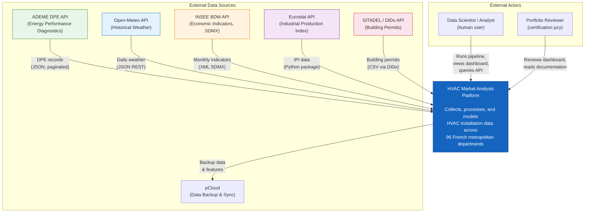
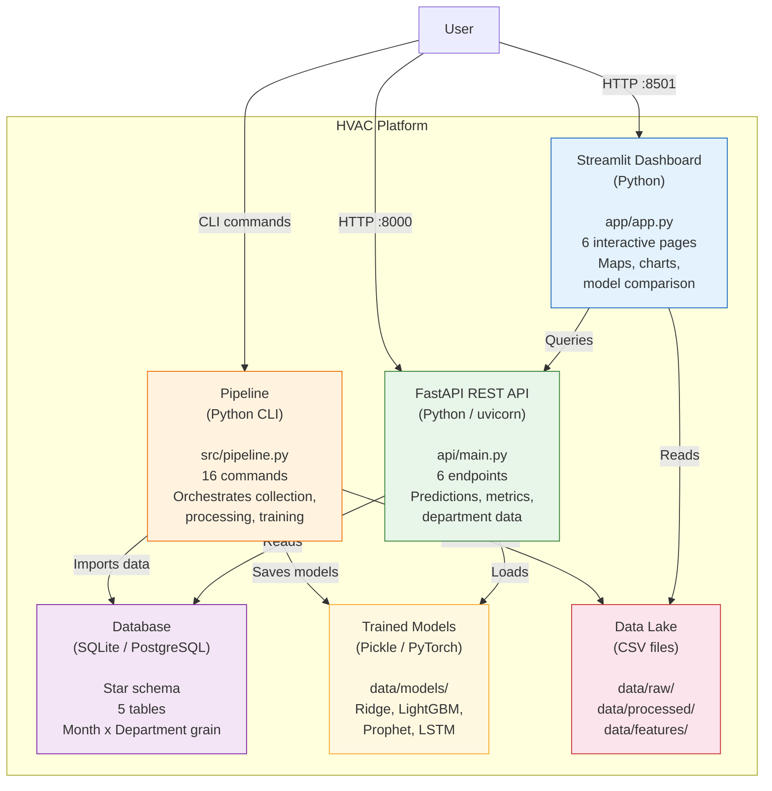
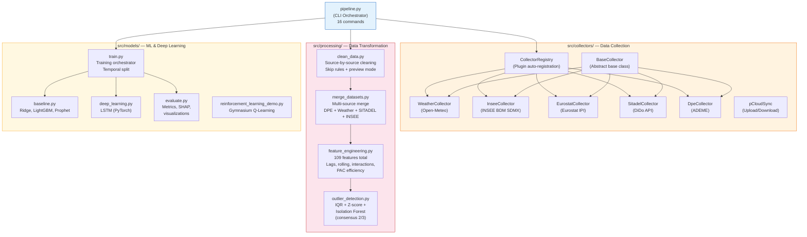
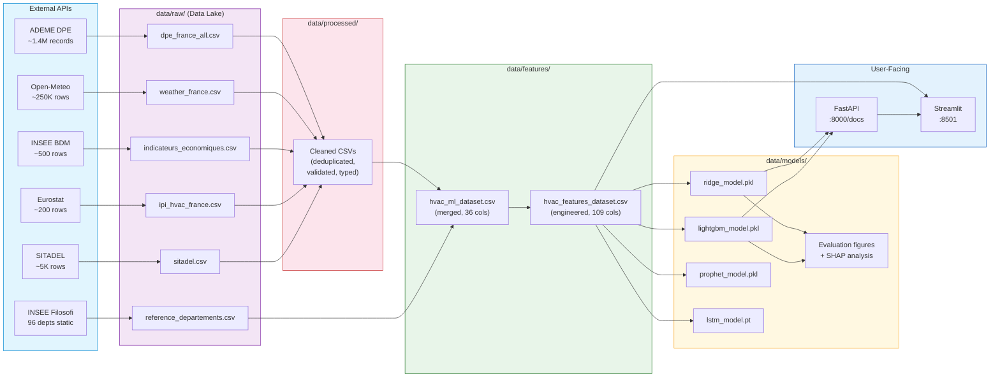
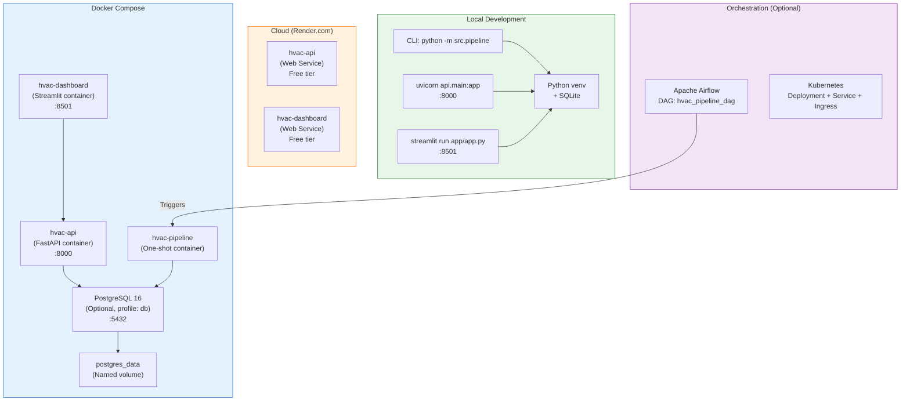
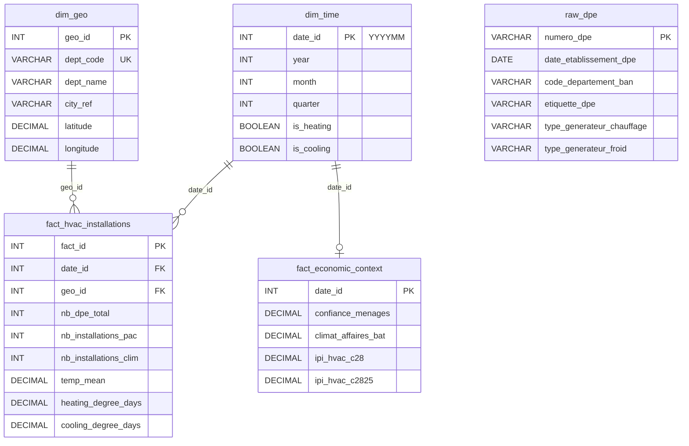

# Architecture — HVAC Market Analysis

> Comprehensive architecture documentation for the HVAC Market Analysis platform.
> Diagrams follow the C4 model (Context, Container, Component) using Mermaid.

---

## 1. C4 Context Diagram

High-level view: the HVAC Market Analysis system and its external actors and data sources.

---

## 2. C4 Container Diagram

The system is composed of four main containers: Pipeline, API, Dashboard, and Database.

---

## 3. C4 Component Diagram — Pipeline

Detailed view of the pipeline's internal components: collectors, processing modules, and model trainers.

---

## 4. Data Flow Diagram

End-to-end data flow from raw sources through processing to predictions.

---

## 5. Deployment Diagram

Multiple deployment options from local development to cloud hosting.

---

## 6. Database Schema (Star Schema)

See [`docs/DATABASE_ARCHITECTURE.md`](DATABASE_ARCHITECTURE.md) for full details.

---

## 7. Technology Stack

| Layer | Technology | Purpose |
|-------|-----------|---------|
| **Language** | Python 3.10+ | Core development language |
| **Data** | pandas, numpy, SQLAlchemy | Data manipulation and ORM |
| **ML** | scikit-learn, LightGBM, Prophet | Classical ML models |
| **Deep Learning** | PyTorch | LSTM time series model |
| **Reinforcement Learning** | Gymnasium | Q-Learning demo |
| **Feature Analysis** | SHAP, XGBoost | Feature importance and explainability |
| **API** | FastAPI, Pydantic, uvicorn | REST API with auto-documentation |
| **Dashboard** | Streamlit, Plotly | Interactive data visualization |
| **Database** | SQLite, PostgreSQL, SQL Server | Multi-engine via SQLAlchemy |
| **DevOps** | Docker, Kubernetes, Airflow | Containerization and orchestration |
| **CI/CD** | GitHub Actions | Automated testing and builds |
| **Cloud** | Render.com | Deployment hosting |
| **Quality** | pytest, ruff, bandit, pip-audit | Testing, linting, security |

---

## 8. Key Design Decisions

### 8.1 ELT over ETL

Raw data is loaded first into `data/raw/`, then transformed. This preserves the source of truth and enables reprocessing without re-collection. Each step is idempotent.

### 8.2 Plugin Architecture for Collectors

New data sources are added by creating a class inheriting from `BaseCollector`. Auto-registration via `__init_subclass__` eliminates boilerplate. No existing code needs modification.

### 8.3 Star Schema for Analytics

The OLAP star schema separates dimensions (time, geography) from facts (installations, economics). This enables efficient aggregation queries with minimal joins, directly compatible with ML feature extraction.

### 8.4 Local-First Design

SQLite is the default database, requiring zero infrastructure. The entire project runs on a single machine with `python -m src.pipeline all`. Cloud and Docker deployments are optional enhancements.

### 8.5 Temporal Train/Val/Test Split

Data is split chronologically (Train: 2021-07 to 2024-06, Val: 2024-07 to 2024-12, Test: 2025-01 to 2025-12) to prevent temporal data leakage and reflect real-world forecasting conditions.

### 8.6 Domain-Driven Feature Engineering

PAC efficiency features encode heat pump physics (COP degradation below -7 degrees C, altitude impact, mountain zone classification). These features capture domain knowledge that pure statistical features cannot.

---

*Architecture documentation for the HVAC Market Analysis project*
*Data Science Lead certification — Jedha Bootcamp (Bac+5 RNCP Level 7)*
