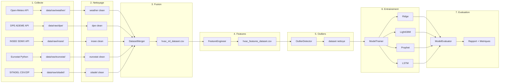
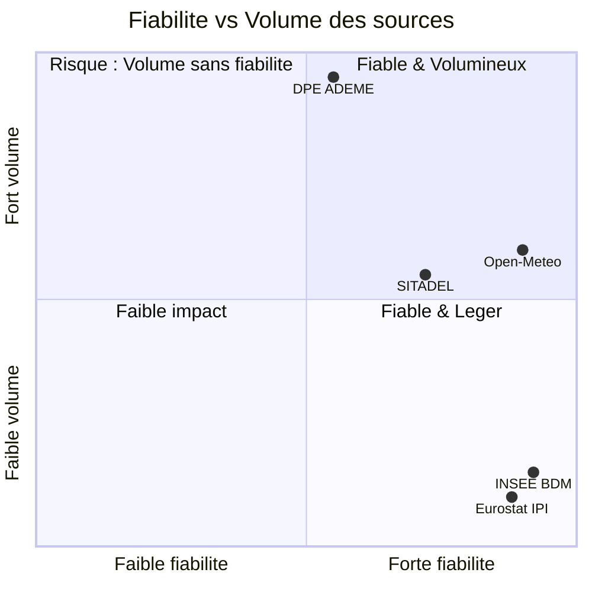
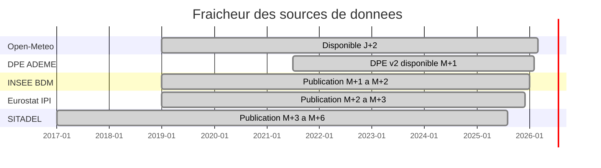
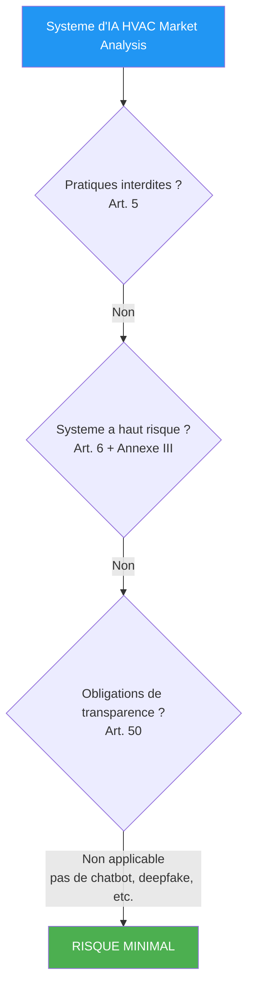
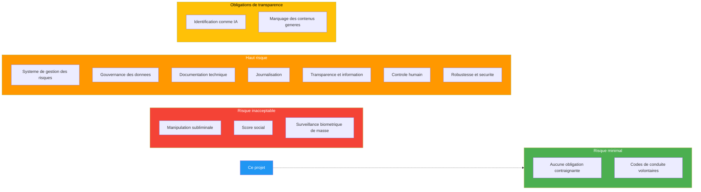
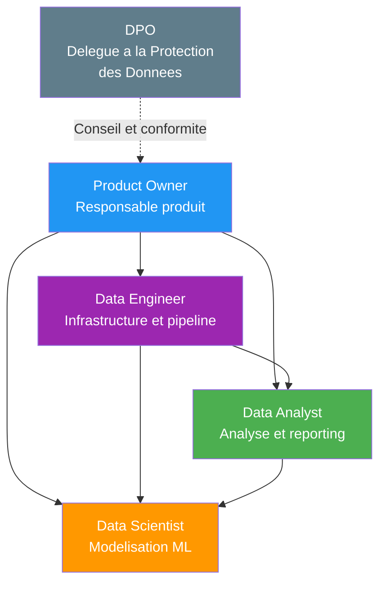
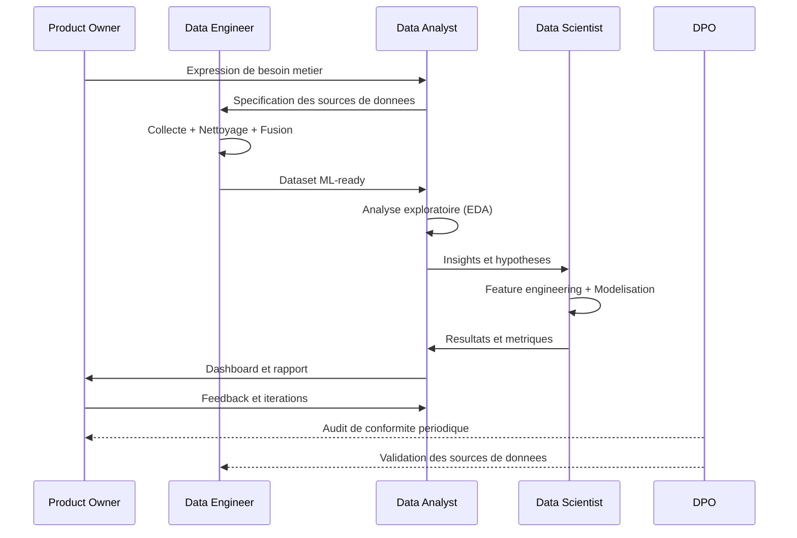
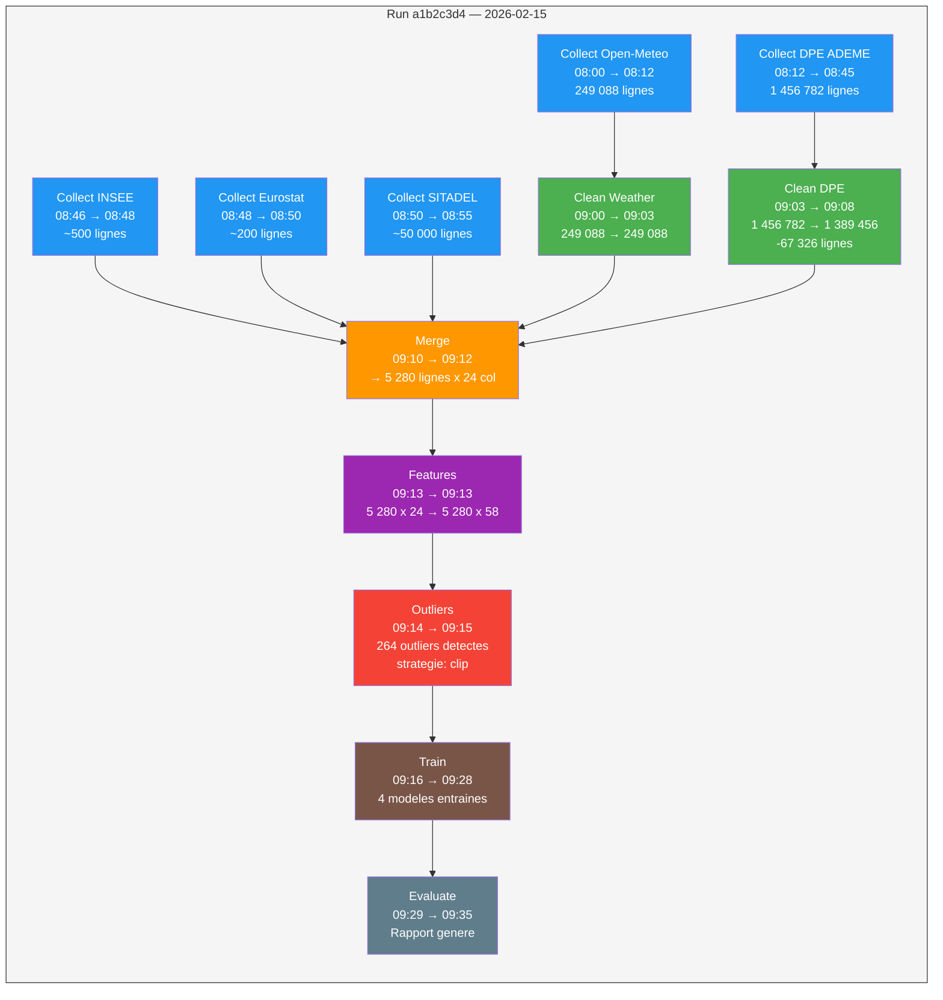

# Gouvernance des Donnees — HVAC Market Analysis

> **Projet** : Analyse et prediction du marche des equipements HVAC sur les 96 departements de France metropolitaine
> **Version** : 1.0
> **Date** : Fevrier 2026
> **Auteur** : Data Analyst — Projet portfolio
> **Statut** : Document de reference

---

## Table des matieres

1. [Politique de gouvernance des donnees](#1-politique-de-gouvernance-des-donnees)
2. [Audit de maturite data](#2-audit-de-maturite-data)
3. [Conformite RGPD](#3-conformite-rgpd)
4. [AI Act — Reglement europeen sur l'intelligence artificielle](#4-ai-act--reglement-europeen-sur-lintelligence-artificielle)
5. [Structure de l'equipe data fictive](#5-structure-de-lequipe-data-fictive)
6. [Metadonnees de lignage](#6-metadonnees-de-lignage)

---

## 1. Politique de gouvernance des donnees

### 1.1 Sources de donnees utilisees

Le projet exploite **5 sources de donnees ouvertes** couvrant les dimensions meteorologique, economique, industrielle, immobiliere et energetique du marche HVAC.

| # | Source | Type | URL / API | Frequence de MAJ | Responsable collecte | Licence |
|---|--------|------|-----------|-------------------|----------------------|---------|
| 1 | **Open-Meteo** | API REST (JSON) | `archive-api.open-meteo.com/v1/archive` | Quotidienne | Data Engineer | CC BY 4.0 |
| 2 | **DPE ADEME** | API REST (JSON) | `data.ademe.fr/data-fair/api/v1/datasets/dpe03existant/lines` | Mensuelle | Data Engineer | Licence Ouverte Etalab 2.0 |
| 3 | **INSEE BDM** | API SDMX (XML) | `www.bdm.insee.fr/series/sdmx` | Mensuelle / Trimestrielle | Data Analyst | Licence Ouverte Etalab 2.0 |
| 4 | **Eurostat** | Package Python (`eurostat`) | Dataset `sts_inpr_m` | Mensuelle | Data Analyst | Licence Eurostat |
| 5 | **SITADEL** | Fichier CSV (ZIP) | `www.statistiques.developpement-durable.gouv.fr` | Mensuelle | Data Engineer | Licence Ouverte Etalab 2.0 |

### 1.2 Qualite des donnees

La qualite des donnees est evaluee selon quatre dimensions conformes au cadre DAMA-DMBOK :

#### 1.2.1 Completude

| Source | Completude estimee | Commentaire |
|--------|--------------------|-------------|
| Open-Meteo | 99 % | Donnees satellitaires interpolees, tres peu de lacunes |
| DPE ADEME | 80-85 % | Champs optionnels parfois vides (type_generateur_climatisation) |
| INSEE BDM | 98 % | Series longues, rarement de rupture |
| Eurostat IPI | 95 % | Quelques mois de retard sur les dernieres publications |
| SITADEL | 90 % | Permis en cours d'instruction non encore enregistres |

#### 1.2.2 Fraicheur

| Source | Delai de mise a disposition | Periode couverte |
|--------|----------------------------|------------------|
| Open-Meteo | J+2 (donnees de la veille) | 2019-01-01 a 2026-02-28 |
| DPE ADEME | M+1 (publication mensuelle) | 2021-07-01 a aujourd'hui |
| INSEE BDM | M+1 a M+2 | 2019-01-01 a aujourd'hui |
| Eurostat IPI | M+2 a M+3 | 2019-01-01 a aujourd'hui |
| SITADEL | M+3 a M+6 | 2017-01-01 a aujourd'hui |

#### 1.2.3 Exactitude

| Source | Niveau d'exactitude | Justification |
|--------|---------------------|---------------|
| Open-Meteo | Elevee | Donnees issues de reanalyses meteorologiques (ERA5), validees scientifiquement |
| DPE ADEME | Moyenne | Donnees declaratives, saisies par les diagnostiqueurs — erreurs humaines possibles |
| INSEE BDM | Elevee | Indicateurs officiels, methodologie rigoureuse et documentee |
| Eurostat IPI | Elevee | Agregation des donnees nationales avec controles de coherence europeens |
| SITADEL | Moyenne-Elevee | Donnees administratives, fiables mais delai de consolidation long |

#### 1.2.4 Coherence

- **Coherence temporelle** : Toutes les sources sont alignees sur une granularite mensuelle lors de la fusion (`date_id` au format `YYYY-MM-01`).
- **Coherence geographique** : Les donnees sont agregees au niveau departemental (96 departements metropolitains). Les donnees nationales (INSEE, Eurostat) sont dupliquees par departement.
- **Coherence des unites** : Les temperatures sont en degres Celsius, les precipitations en millimetres, les indices economiques en base 100.
- **Coherence des codes** : Les codes departement respectent le format INSEE (01 a 95 + 2A + 2B).

### 1.3 Lignage des donnees

Le lignage trace le parcours complet des donnees, de la source brute jusqu'a la prediction finale. Chaque etape est documentee, reproductible et idempotente.



#### Detail des etapes du lignage

| Etape | Module | Entree | Sortie | Transformations cles |
|-------|--------|--------|--------|---------------------|
| 1. Collecte | `src/collectors/*.py` | APIs externes | `data/raw/*.csv` | Appels HTTP, pagination, parsing JSON/XML/CSV |
| 2. Nettoyage | `src/processing/clean_data.py` | `data/raw/*.csv` | `data/processed/*.csv` | Deduplication, typage, gestion NaN, filtrage |
| 3. Fusion | `src/processing/merge_datasets.py` | `data/processed/*.csv` | `data/features/hvac_ml_dataset.csv` | Agregation mois x dept, LEFT JOIN multi-sources |
| 4. Features | `src/processing/feature_engineering.py` | `hvac_ml_dataset.csv` | `hvac_features_dataset.csv` | Lags (1-6 mois), rolling (3, 6 mois), interactions |
| 5. Outliers | `src/processing/outlier_detection.py` | `hvac_features_dataset.csv` | Dataset traite | IQR + Z-score modifie + Isolation Forest, clipping |
| 6. Entrainement | `src/models/train.py` | Dataset traite | Modeles serialises | Split temporel, cross-validation, hyperparametres |
| 7. Evaluation | `src/models/evaluate.py` | Modeles + donnees test | Rapport + figures | RMSE, MAE, R2, SHAP, residus, feature importance |

### 1.4 Catalogue de donnees

#### 1.4.1 Fichiers bruts (`data/raw/`)

| Fichier | Source | Description | Colonnes cles | Volume approx. |
|---------|--------|-------------|---------------|-----------------|
| `weather/weather_france.csv` | Open-Meteo | Donnees meteo quotidiennes pour 96 prefectures | `date`, `city`, `dept`, `temperature_2m_mean`, `HDD`, `CDD`, `precipitation_sum` | ~250 000 lignes |
| `dpe/dpe_france_all.csv` | DPE ADEME | Diagnostics de performance energetique | `date_etablissement_dpe`, `code_departement_ban`, `type_installation_chauffage`, `etiquette_dpe` | ~1-2M lignes |
| `insee/indicateurs_economiques.csv` | INSEE BDM | Series economiques mensuelles | `date`, `confiance_menages`, `climat_affaires_industrie`, `ipi_industrie_manuf` | ~500 lignes |
| `eurostat/ipi_hvac_france.csv` | Eurostat | Indice de production industrielle HVAC | `date`, `nace`, `ipi_value` | ~200 lignes |
| `sitadel/permis_construire_france.csv` | SITADEL | Permis de construire logements | `date`, `dept`, `nb_logements_commences`, `nb_logements_autorises` | ~50 000 lignes |

#### 1.4.2 Fichiers traites (`data/processed/`)

| Fichier | Description | Transformations appliquees |
|---------|-------------|---------------------------|
| `weather/weather_france.csv` | Meteo nettoyee | Deduplication, types, NaN interpoles |
| `dpe/dpe_france_clean.csv` | DPE nettoyes | Filtrage DPE v2, deduplication, normalisation codes postaux |
| `insee/indicateurs_economiques.csv` | Indicateurs economiques nettoyes | Typage dates, interpolation lineaire des NaN |
| `eurostat/ipi_hvac_france.csv` | IPI nettoye | Filtrage France, codes NACE C28/C2825 |

#### 1.4.3 Fichiers features (`data/features/`)

| Fichier | Description | Dimensions |
|---------|-------------|------------|
| `hvac_ml_dataset.csv` | Dataset fusionne (mois x departement) | ~5 000+ lignes x 20+ colonnes |
| `hvac_features_dataset.csv` | Dataset avec features avancees | ~5 000+ lignes x 50+ colonnes |

#### 1.4.4 Base de donnees (`data/hvac_market.db`)

La base SQLite contient les tables suivantes :

| Table | Description | Cle primaire |
|-------|-------------|-------------|
| `dim_time` | Dimension temporelle (mois, trimestre, annee) | `date_id` |
| `dim_geo` | Dimension geographique (departements, regions) | `dept` |
| `fact_hvac_installations` | Table de faits — installations HVAC | `date_id` + `dept` |
| `fact_economic_context` | Table de faits — contexte economique | `date_id` |

---

## 2. Audit de maturite data

### 2.1 Grille de maturite data

La grille ci-dessous s'inspire du modele CMMI Data Management Maturity (DMM) adapte au contexte d'un projet analytique individuel.

| Niveau | Intitule | Description | Criteres cles |
|--------|----------|-------------|---------------|
| **1** | Initial | Donnees gerees de maniere ad hoc, pas de processus | Pas de documentation, collecte manuelle |
| **2** | Reproductible | Processus definis mais non automatises | Scripts documentes, structure de repertoires |
| **3** | Defini | Pipeline automatise, qualite mesuree | Orchestration, tests unitaires, metriques |
| **4** | Gere | Monitoring, alertes, versioning des donnees | Observabilite, CI/CD, data contracts |
| **5** | Optimise | Amelioration continue, feedback loops | A/B testing, retraining automatique |

### 2.2 Auto-evaluation du projet

```mermaid
radar
    title Maturite data du projet HVAC Market Analysis
```

En l'absence de support natif des radar charts en Mermaid, voici l'evaluation sous forme de tableau :

| Dimension | Niveau atteint | Justification |
|-----------|----------------|---------------|
| **Collecte** | 3/5 | Pipeline automatise (`python -m src.pipeline collect`), collecteurs modulaires avec registry, retry et rate limiting |
| **Nettoyage** | 3/5 | `DataCleaner` centralise, regles documentees, idempotent, tests unitaires |
| **Stockage** | 2/5 | SQLite local, pas de data warehouse, pas de versioning des donnees |
| **Transformation** | 3/5 | Feature engineering structure, fusion multi-sources documentee |
| **Qualite** | 2/5 | Detection d'outliers implementee, mais pas de monitoring continu |
| **Documentation** | 3/5 | Docstrings, collector module docs, ce document de gouvernance |
| **Securite / RGPD** | 4/5 | Uniquement des donnees Open Data anonymisees, aucune donnee personnelle |
| **ML / Modelisation** | 3/5 | 4 modeles (Ridge, LightGBM, Prophet, LSTM), evaluation SHAP, split temporel |
| **Deploiement** | 3/5 | Streamlit + FastAPI, Docker, GitHub Actions CI/CD, Kubernetes manifests |
| **Gouvernance** | 3/5 | Ce document, catalogue de donnees, lignage trace |

**Score global estime : 2.8 / 5** — Le projet se situe entre les niveaux "Reproductible" et "Defini". Les principaux axes d'amelioration sont le monitoring continu, le versioning des donnees et le deploiement CI/CD.

### 2.3 Types de donnees

| Type | Format | Sources | Particularites |
|------|--------|---------|----------------|
| **Structurees** | CSV, SQLite | Toutes les sources apres collecte | Schema fixe, types definis, requetables en SQL |
| **Semi-structurees** | JSON (API REST) | Open-Meteo, DPE ADEME | Parsing necessaire, schema variable selon les parametres |
| **Semi-structurees** | XML SDMX | INSEE BDM | Standard statistique, parsing via `lxml` |
| **Agregees** | CSV | Dataset ML final | Donnees agregees mois x departement, prete pour la modelisation |

### 2.4 Fiabilite par source



| Source | Fiabilite | Justification detaillee |
|--------|-----------|------------------------|
| **Open-Meteo** | Tres fiable | Donnees de reanalyse ERA5 (ECMWF), validees par la communaute scientifique, couverture mondiale, interpolation spatiale robuste |
| **DPE ADEME** | Moyennement fiable | Donnees declaratives saisies par des diagnostiqueurs certifies mais sujettes a des erreurs humaines ; anonymisation avant publication pouvant entrainer des pertes d'information |
| **INSEE BDM** | Tres fiable | Institut national de statistique, methodologie transparente, series corrigees des variations saisonnieres (CVS) |
| **Eurostat IPI** | Fiable | Agregation europeenne des statistiques nationales, controles de coherence inter-pays |
| **SITADEL** | Fiable | Donnees administratives issues des services de l'urbanisme, mais delais de consolidation importants (3 a 6 mois) |

### 2.5 Fraicheur des donnees



| Source | Frequence de collecte | Delai de disponibilite | Impact sur le projet |
|--------|----------------------|------------------------|---------------------|
| Open-Meteo | Quotidienne | J+2 | Faible : donnees presque en temps reel |
| DPE ADEME | Mensuelle | M+1 | Moyen : variable cible disponible avec un mois de retard |
| INSEE BDM | Mensuelle | M+1 a M+2 | Moyen : indicateurs conjoncturels avec retard modere |
| Eurostat IPI | Mensuelle | M+2 a M+3 | Moyen-Fort : retard pouvant impacter les predictions recentes |
| SITADEL | Mensuelle | M+3 a M+6 | Fort : donnees significativement decalees, utiles surtout pour l'historique |

---

## 3. Conformite RGPD

### 3.1 Synthese : pas de donnees personnelles

> **Conclusion principale** : Ce projet utilise **exclusivement des donnees ouvertes (Open Data) et des donnees agregees**. Aucune donnee a caractere personnel au sens de l'article 4(1) du RGPD n'est collectee, traitee ou stockee.

### 3.2 Analyse article par article

#### Article 4 — Definitions

| Concept | Analyse pour ce projet |
|---------|----------------------|
| **Donnee a caractere personnel** (art. 4.1) | Aucune donnee permettant d'identifier directement ou indirectement une personne physique. Les DPE sont anonymises par l'ADEME avant publication (pas de nom, pas d'adresse exacte). Les indicateurs economiques sont des agregats nationaux. |
| **Traitement** (art. 4.2) | Les operations realisees (collecte, nettoyage, agregation, modelisation) constituent un traitement au sens du RGPD, mais celui-ci ne porte pas sur des donnees personnelles. |
| **Responsable du traitement** (art. 4.7) | Non applicable — pas de donnees personnelles traitees. |

#### Article 5 — Principes relatifs au traitement

| Principe | Conformite | Detail |
|----------|------------|--------|
| **Liceite, loyaute, transparence** (art. 5.1.a) | Conforme | Toutes les sources sont publiques, sous licence ouverte (Etalab 2.0, CC BY 4.0). Le traitement est documente dans ce document et dans le code source. |
| **Limitation des finalites** (art. 5.1.b) | Conforme | Les donnees sont utilisees exclusivement pour l'analyse du marche HVAC et la prediction d'installations. Pas de reutilisation a d'autres fins. |
| **Minimisation des donnees** (art. 5.1.c) | Conforme | Seules les colonnes necessaires sont selectionnees lors de la collecte (parametre `select` de l'API DPE). Les donnees sont agregees au niveau mois x departement. |
| **Exactitude** (art. 5.1.d) | Conforme | Le pipeline de nettoyage (`clean_data.py`) corrige les incoherences, supprime les doublons et traite les valeurs aberrantes. |
| **Limitation de la conservation** (art. 5.1.e) | Non applicable | Donnees publiques sans contrainte de duree de conservation. |
| **Integrite et confidentialite** (art. 5.1.f) | Conforme | Base SQLite locale, pas d'exposition reseau, pas de donnees sensibles. |

#### Article 6 — Licite du traitement

| Base legale | Applicabilite |
|-------------|---------------|
| **Consentement** (art. 6.1.a) | Non applicable — pas de donnees personnelles |
| **Execution d'un contrat** (art. 6.1.b) | Non applicable |
| **Obligation legale** (art. 6.1.c) | Non applicable |
| **Interet vital** (art. 6.1.d) | Non applicable |
| **Mission d'interet public** (art. 6.1.e) | Non applicable |
| **Interet legitime** (art. 6.1.f) | Non applicable — mais si le projet evoluait vers des donnees personnelles, l'interet legitime (analyse de marche) pourrait etre invoque sous reserve d'une analyse de balance des interets |

> **Note** : Le RGPD ne s'applique pas stricto sensu a ce projet car aucune donnee a caractere personnel n'est traitee. L'analyse ci-dessus est fournie a titre pedagogique et de bonne pratique.

#### Article 25 — Protection des donnees des la conception (Privacy by Design)

Bien que le RGPD ne s'applique pas directement, le projet integre les principes de Privacy by Design :

| Principe Privacy by Design | Implementation dans le projet |
|-----------------------------|------------------------------|
| **Proactif, pas reactif** | Choix delibere de n'utiliser que des donnees Open Data des la conception du projet |
| **Protection par defaut** | Pas de collecte de donnees individuelles, agregation systematique au niveau departement |
| **Minimisation** | Selection des colonnes strictement necessaires via le parametre `select` de l'API DPE |
| **Transparence** | Code source documente, pipeline reproductible, document de gouvernance public |
| **Securite de bout en bout** | Base SQLite locale, pas d'exposition reseau, fichier `.env` pour les eventuels tokens |
| **Respect de la vie privee** | Aucune tentative de re-identification, donnees anonymisees en entree |

#### Anonymisation des DPE par l'ADEME

L'ADEME applique les traitements d'anonymisation suivants avant publication des DPE sur `data.ademe.fr` :

- **Suppression** des noms et adresses exactes des proprietaires
- **Generalisation** de l'adresse au code postal (et non a l'adresse complete)
- **Attribution** d'un numero DPE anonyme (`numero_dpe`) sans lien avec l'identite du diagnostiqueur ou du proprietaire
- **Agregation** possible par code departemental (`code_departement_ban`)

Le risque de re-identification est considere comme **negligeable** compte tenu de la granularite des donnees exploitees (niveau departement, agregation mensuelle).

### 3.3 Recommandations si le projet evoluait vers des donnees individuelles

Si le projet devait a l'avenir integrer des donnees a caractere personnel (par exemple, donnees de consommation energetique individuelles, historique d'achats de clients), les mesures suivantes seraient necessaires :

| Mesure | Description | Priorite |
|--------|-------------|----------|
| **Analyse d'impact (AIPD)** | Realiser une analyse d'impact relative a la protection des donnees (art. 35 RGPD) | Critique |
| **Registre des traitements** | Tenir un registre conforme a l'art. 30 RGPD | Critique |
| **Designation d'un DPO** | Designer un Delegue a la Protection des Donnees | Elevee |
| **Base legale** | Identifier et documenter la base legale (consentement, interet legitime, etc.) | Critique |
| **Droit des personnes** | Implementer les droits d'acces, de rectification, d'effacement, de portabilite | Critique |
| **Pseudonymisation** | Appliquer des techniques de pseudonymisation/anonymisation avant traitement analytique | Elevee |
| **Chiffrement** | Chiffrer les donnees au repos et en transit | Elevee |
| **Contrats sous-traitants** | Mettre en place des clauses contractuelles avec les eventuels prestataires (art. 28) | Moyenne |
| **Notification de violations** | Mettre en place un processus de notification en cas de violation de donnees (art. 33-34) | Elevee |

---

## 4. AI Act — Reglement europeen sur l'intelligence artificielle

### 4.1 Contexte reglementaire

Le Reglement europeen sur l'intelligence artificielle (AI Act, Reglement (UE) 2024/1689) est entre en vigueur le 1er aout 2024. Il etablit un cadre juridique pour le developpement, la mise sur le marche et l'utilisation de systemes d'IA dans l'Union europeenne, fonde sur une approche par les risques.

### 4.2 Classification du systeme



#### Justification de la classification "Risque minimal"

| Critere AI Act | Analyse |
|----------------|---------|
| **Pratiques interdites** (art. 5) | Non concerne. Le systeme ne realise aucune manipulation subliminale, exploitation de vulnerabilites, notation sociale ou surveillance biometrique. |
| **Systeme a haut risque** (Annexe III) | Non concerne. Le systeme n'entre dans aucune des categories listees : pas d'identification biometrique, pas d'infrastructure critique, pas d'acces a l'education, pas d'evaluation de solvabilite, pas de recrutement, pas de decision judiciaire, pas de gestion de la migration. |
| **Transparence** (art. 50) | Non concerne. Le systeme n'est pas un chatbot, ne genere pas de deepfakes, ne produit pas de contenu synthetique destine au public. |
| **Risque minimal** (art. 52 et suivants) | **Classification retenue.** Le systeme est un outil d'analyse de marche et de prevision statistique. Il produit des predictions agregees au niveau departemental, sans impact direct sur des personnes physiques. |

### 4.3 Obligations applicables (risque minimal)

Les systemes a risque minimal ne sont soumis a **aucune obligation contraignante** au titre de l'AI Act. Neanmoins, la Commission europeenne encourage l'adoption volontaire de codes de conduite (art. 95).

Le projet applique volontairement les bonnes pratiques suivantes :

| Bonne pratique | Implementation |
|----------------|----------------|
| **Transparence** | Documentation complete du pipeline (ce document), code source commente, methodologie reproductible |
| **Qualite des donnees** | Pipeline de nettoyage, detection d'outliers, lignage des donnees trace |
| **Supervision humaine** | Les predictions sont des aides a la decision, pas des decisions automatisees |
| **Documentation technique** | Architecture documentee, catalogue de donnees, metriques d'evaluation |

### 4.4 Si le systeme etait deploye en production

Dans l'hypothese ou ce systeme serait deploye en production dans une entreprise, les obligations supplementaires suivantes s'appliqueraient selon le niveau de risque :

#### Scenario A : Deploiement interne (outil d'aide a la decision pour equipes commerciales)

Classification maintenue : **Risque minimal**. Pas d'obligation supplementaire, mais les bonnes pratiques ci-dessus restent recommandees.

#### Scenario B : Deploiement impactant des personnes (ex: tarification energetique individualisee)

Classification potentielle : **Haut risque** (Annexe III, 5.b — acces aux services essentiels).

| Obligation | Detail |
|------------|--------|
| **Systeme de gestion des risques** (art. 9) | Identification, estimation et evaluation des risques tout au long du cycle de vie |
| **Gouvernance des donnees** (art. 10) | Qualite des donnees d'entrainement, tests de biais, representativite |
| **Documentation technique** (art. 11) | Description detaillee du systeme, performances, limites connues |
| **Journalisation** (art. 12) | Logs automatiques pour assurer la tracabilite des decisions |
| **Transparence** (art. 13) | Information claire aux utilisateurs sur le fonctionnement du systeme |
| **Controle humain** (art. 14) | Mecanismes permettant une supervision humaine effective |
| **Robustesse et cybersecurite** (art. 15) | Precision, resilience, securite du systeme |
| **Evaluation de conformite** (art. 43) | Evaluation par un organisme notifie ou auto-evaluation documentee |

### 4.5 Synthese des obligations par categorie de risque



---

## 5. Structure de l'equipe data fictive

### 5.1 Organigramme

L'organigramme ci-dessous represente l'equipe qui maintiendrait ce projet dans un contexte d'entreprise.



### 5.2 Description des roles

| Role | Effectif | Responsabilites principales |
|------|----------|---------------------------|
| **Product Owner** | 1 | Definition de la vision produit, priorisation du backlog, validation des livrables, interface avec les parties prenantes metier (equipes commerciales, direction strategie) |
| **Data Engineer** | 1 | Conception et maintenance du pipeline de collecte, gestion de l'infrastructure de stockage (BDD, cloud), monitoring de la qualite des donnees, deploiement CI/CD |
| **Data Analyst** | 1 | Analyse exploratoire (EDA), creation de dashboards (Streamlit), reporting metier, documentation des metriques, communication des insights aux parties prenantes |
| **Data Scientist** | 1 | Feature engineering, selection et entrainement des modeles ML, evaluation des performances, analyse SHAP/interpretabilite, detection de drift |
| **DPO** (temps partiel) | 0.2 | Veille reglementaire RGPD/AI Act, audits de conformite, conseil sur les traitements de donnees, formation de l'equipe, tenue du registre des traitements |

### 5.3 Matrice RACI

La matrice RACI definit les responsabilites de chaque role pour chaque etape du pipeline. Les niveaux sont :

- **R** (Responsible) : Realise la tache
- **A** (Accountable) : Rend des comptes, valide le resultat
- **C** (Consulted) : Consulte avant ou pendant la realisation
- **I** (Informed) : Informe du resultat

| Etape du pipeline | Product Owner | Data Engineer | Data Analyst | Data Scientist | DPO |
|-------------------|:------------:|:-------------:|:------------:|:--------------:|:---:|
| **1. Definition des besoins** | **A** | C | **R** | C | I |
| **2. Collecte des donnees** | I | **R/A** | C | I | C |
| **3. Nettoyage** | I | **R** | C | C | I |
| **4. Fusion multi-sources** | I | **R/A** | C | C | I |
| **5. Feature engineering** | I | C | C | **R/A** | I |
| **6. Detection d'outliers** | I | I | C | **R/A** | I |
| **7. Analyse exploratoire** | C | I | **R/A** | C | I |
| **8. Entrainement ML** | I | C | I | **R/A** | I |
| **9. Evaluation des modeles** | C | I | C | **R/A** | I |
| **10. Deploiement** | **A** | **R** | C | C | C |
| **11. Monitoring & maintenance** | I | **R/A** | C | C | I |
| **12. Conformite RGPD / AI Act** | C | I | I | I | **R/A** |
| **13. Documentation** | **A** | C | **R** | C | C |
| **14. Communication des resultats** | **A** | I | **R** | C | I |

### 5.4 Interactions entre les roles



---

## 6. Metadonnees de lignage

### 6.1 Format des metadonnees

Chaque execution du pipeline genere des metadonnees de lignage au format JSON. Ces metadonnees permettent de tracer l'origine, les transformations et la qualite des donnees a chaque etape.

#### Schema des metadonnees

```json
{
  "run_id": "string (UUID v4)",
  "timestamp_start": "string (ISO 8601)",
  "timestamp_end": "string (ISO 8601)",
  "pipeline_version": "string (semver)",
  "stage": "string (nom de l'etape)",
  "source": {
    "name": "string (nom de la source)",
    "url": "string (URL de l'API ou du fichier)",
    "date_collecte": "string (ISO 8601)",
    "format": "string (json, xml, csv, zip)"
  },
  "input": {
    "file_path": "string (chemin du fichier d'entree)",
    "nb_lignes": "integer",
    "nb_colonnes": "integer",
    "hash_sha256": "string (empreinte du fichier)"
  },
  "output": {
    "file_path": "string (chemin du fichier de sortie)",
    "nb_lignes": "integer",
    "nb_colonnes": "integer",
    "hash_sha256": "string (empreinte du fichier)"
  },
  "transformations": [
    {
      "operation": "string (nom de l'operation)",
      "params": "object (parametres de l'operation)",
      "lignes_avant": "integer",
      "lignes_apres": "integer",
      "lignes_supprimees": "integer"
    }
  ],
  "qualite": {
    "completude_pct": "float (0-100)",
    "nb_doublons_supprimes": "integer",
    "nb_nan_total": "integer",
    "nb_outliers_detectes": "integer"
  },
  "environnement": {
    "python_version": "string",
    "os": "string",
    "hostname": "string",
    "config_hash": "string (hash de la configuration)"
  }
}
```

### 6.2 Description des champs

| Champ | Type | Description |
|-------|------|-------------|
| `run_id` | UUID v4 | Identifiant unique de l'execution |
| `timestamp_start` | ISO 8601 | Horodatage de debut de l'etape |
| `timestamp_end` | ISO 8601 | Horodatage de fin de l'etape |
| `pipeline_version` | Semver | Version du code du pipeline |
| `stage` | String | Nom de l'etape (collect, clean, merge, features, outliers, train, evaluate) |
| `source.name` | String | Nom de la source de donnees |
| `source.url` | String | URL d'origine des donnees |
| `source.date_collecte` | ISO 8601 | Date a laquelle les donnees ont ete collectees |
| `source.format` | String | Format des donnees brutes |
| `input.file_path` | String | Chemin du fichier d'entree |
| `input.nb_lignes` | Integer | Nombre de lignes en entree |
| `input.hash_sha256` | String | Hash SHA-256 du fichier d'entree pour verification d'integrite |
| `output.file_path` | String | Chemin du fichier de sortie |
| `output.nb_lignes` | Integer | Nombre de lignes en sortie |
| `transformations` | Array | Liste ordonnee des transformations appliquees |
| `qualite.completude_pct` | Float | Pourcentage de cellules non nulles |
| `environnement` | Object | Contexte d'execution pour la reproductibilite |

### 6.3 Exemple concret de trace de lignage — Run complet

L'exemple ci-dessous simule une trace de lignage pour une execution complete du pipeline le 15 fevrier 2026.

#### Etape 1 : Collecte Open-Meteo

```json
{
  "run_id": "a1b2c3d4-e5f6-7890-abcd-ef1234567890",
  "timestamp_start": "2026-02-15T08:00:00Z",
  "timestamp_end": "2026-02-15T08:12:34Z",
  "pipeline_version": "1.0.0",
  "stage": "collect",
  "source": {
    "name": "open_meteo",
    "url": "https://archive-api.open-meteo.com/v1/archive",
    "date_collecte": "2026-02-15",
    "format": "json"
  },
  "input": {
    "file_path": null,
    "nb_lignes": null,
    "nb_colonnes": null,
    "hash_sha256": null
  },
  "output": {
    "file_path": "data/raw/weather/weather_france.csv",
    "nb_lignes": 249088,
    "nb_colonnes": 9,
    "hash_sha256": "e3b0c44298fc1c149afbf4c8996fb92427ae41e4649b934ca495991b7852b855"
  },
  "transformations": [
    {
      "operation": "api_fetch",
      "params": {"cities": 96, "start_date": "2019-01-01", "end_date": "2026-02-28", "variables": ["temperature_2m_max", "temperature_2m_min", "temperature_2m_mean", "precipitation_sum", "wind_speed_10m_max"]},
      "lignes_avant": 0,
      "lignes_apres": 249088,
      "lignes_supprimees": 0
    },
    {
      "operation": "compute_hdd_cdd",
      "params": {"base_temp": 18.0},
      "lignes_avant": 249088,
      "lignes_apres": 249088,
      "lignes_supprimees": 0
    }
  ],
  "qualite": {
    "completude_pct": 99.7,
    "nb_doublons_supprimes": 0,
    "nb_nan_total": 743,
    "nb_outliers_detectes": 0
  },
  "environnement": {
    "python_version": "3.11.7",
    "os": "Linux 4.4.0",
    "hostname": "hvac-pipeline-01",
    "config_hash": "sha256:abc123..."
  }
}
```

#### Etape 2 : Collecte DPE ADEME

```json
{
  "run_id": "a1b2c3d4-e5f6-7890-abcd-ef1234567891",
  "timestamp_start": "2026-02-15T08:12:35Z",
  "timestamp_end": "2026-02-15T08:45:12Z",
  "pipeline_version": "1.0.0",
  "stage": "collect",
  "source": {
    "name": "dpe_ademe",
    "url": "https://data.ademe.fr/data-fair/api/v1/datasets/dpe03existant/lines",
    "date_collecte": "2026-02-15",
    "format": "json"
  },
  "output": {
    "file_path": "data/raw/dpe/dpe_france_all.csv",
    "nb_lignes": 1456782,
    "nb_colonnes": 12,
    "hash_sha256": "f4a3b2c1d0e9f8a7b6c5d4e3f2a1b0c9d8e7f6a5b4c3d2e1f0a9b8c7d6e5f4"
  },
  "transformations": [
    {
      "operation": "api_fetch_paginated",
      "params": {"size": 10000, "departments": 96, "select": "numero_dpe,date_etablissement_dpe,etiquette_dpe,..."},
      "lignes_avant": 0,
      "lignes_apres": 1456782,
      "lignes_supprimees": 0
    }
  ],
  "qualite": {
    "completude_pct": 82.3,
    "nb_doublons_supprimes": 0,
    "nb_nan_total": 258412,
    "nb_outliers_detectes": 0
  }
}
```

#### Etape 3 : Nettoyage DPE

```json
{
  "run_id": "a1b2c3d4-e5f6-7890-abcd-ef1234567892",
  "timestamp_start": "2026-02-15T09:00:00Z",
  "timestamp_end": "2026-02-15T09:08:45Z",
  "pipeline_version": "1.0.0",
  "stage": "clean",
  "source": {
    "name": "dpe_ademe",
    "url": null,
    "date_collecte": "2026-02-15",
    "format": "csv"
  },
  "input": {
    "file_path": "data/raw/dpe/dpe_france_all.csv",
    "nb_lignes": 1456782,
    "nb_colonnes": 12,
    "hash_sha256": "f4a3b2c1..."
  },
  "output": {
    "file_path": "data/processed/dpe/dpe_france_clean.csv",
    "nb_lignes": 1389456,
    "nb_colonnes": 12,
    "hash_sha256": "a1b2c3d4..."
  },
  "transformations": [
    {
      "operation": "drop_duplicates",
      "params": {"subset": ["numero_dpe"]},
      "lignes_avant": 1456782,
      "lignes_apres": 1442108,
      "lignes_supprimees": 14674
    },
    {
      "operation": "filter_dpe_v2",
      "params": {"date_min": "2021-07-01"},
      "lignes_avant": 1442108,
      "lignes_apres": 1398234,
      "lignes_supprimees": 43874
    },
    {
      "operation": "normalize_codes_postaux",
      "params": {},
      "lignes_avant": 1398234,
      "lignes_apres": 1389456,
      "lignes_supprimees": 8778
    }
  ],
  "qualite": {
    "completude_pct": 87.1,
    "nb_doublons_supprimes": 14674,
    "nb_nan_total": 179029,
    "nb_outliers_detectes": 0
  }
}
```

#### Etape 4 : Fusion multi-sources

```json
{
  "run_id": "a1b2c3d4-e5f6-7890-abcd-ef1234567893",
  "timestamp_start": "2026-02-15T09:10:00Z",
  "timestamp_end": "2026-02-15T09:12:30Z",
  "pipeline_version": "1.0.0",
  "stage": "merge",
  "input": {
    "file_path": "data/processed/ (multiple)",
    "nb_lignes": null,
    "nb_colonnes": null,
    "hash_sha256": null
  },
  "output": {
    "file_path": "data/features/hvac_ml_dataset.csv",
    "nb_lignes": 5280,
    "nb_colonnes": 24,
    "hash_sha256": "b2c3d4e5..."
  },
  "transformations": [
    {
      "operation": "aggregate_dpe_monthly",
      "params": {"groupby": ["date_id", "dept"], "agg": "count"},
      "lignes_avant": 1389456,
      "lignes_apres": 5280,
      "lignes_supprimees": 0
    },
    {
      "operation": "aggregate_weather_monthly",
      "params": {"groupby": ["date_id", "dept"], "agg": "mean"},
      "lignes_avant": 249088,
      "lignes_apres": 5280,
      "lignes_supprimees": 0
    },
    {
      "operation": "left_join_insee",
      "params": {"on": "date_id"},
      "lignes_avant": 5280,
      "lignes_apres": 5280,
      "lignes_supprimees": 0
    },
    {
      "operation": "left_join_eurostat",
      "params": {"on": "date_id"},
      "lignes_avant": 5280,
      "lignes_apres": 5280,
      "lignes_supprimees": 0
    }
  ],
  "qualite": {
    "completude_pct": 94.2,
    "nb_doublons_supprimes": 0,
    "nb_nan_total": 312,
    "nb_outliers_detectes": 0
  }
}
```

#### Etape 5 : Feature Engineering

```json
{
  "run_id": "a1b2c3d4-e5f6-7890-abcd-ef1234567894",
  "timestamp_start": "2026-02-15T09:13:00Z",
  "timestamp_end": "2026-02-15T09:13:45Z",
  "pipeline_version": "1.0.0",
  "stage": "features",
  "input": {
    "file_path": "data/features/hvac_ml_dataset.csv",
    "nb_lignes": 5280,
    "nb_colonnes": 24,
    "hash_sha256": "b2c3d4e5..."
  },
  "output": {
    "file_path": "data/features/hvac_features_dataset.csv",
    "nb_lignes": 5280,
    "nb_colonnes": 58,
    "hash_sha256": "c3d4e5f6..."
  },
  "transformations": [
    {
      "operation": "add_lags",
      "params": {"columns": ["nb_installations_pac", "HDD", "CDD"], "lags": [1, 2, 3, 6]},
      "lignes_avant": 5280,
      "lignes_apres": 5280,
      "lignes_supprimees": 0
    },
    {
      "operation": "add_rolling_stats",
      "params": {"windows": [3, 6], "stats": ["mean", "std"]},
      "lignes_avant": 5280,
      "lignes_apres": 5280,
      "lignes_supprimees": 0
    },
    {
      "operation": "add_interactions",
      "params": {"pairs": [["HDD", "confiance_menages"], ["CDD", "climat_affaires"]]},
      "lignes_avant": 5280,
      "lignes_apres": 5280,
      "lignes_supprimees": 0
    },
    {
      "operation": "add_calendar_features",
      "params": {"features": ["month", "quarter", "year", "sin_month", "cos_month"]},
      "lignes_avant": 5280,
      "lignes_apres": 5280,
      "lignes_supprimees": 0
    }
  ],
  "qualite": {
    "completude_pct": 88.5,
    "nb_doublons_supprimes": 0,
    "nb_nan_total": 6780,
    "nb_outliers_detectes": 0
  }
}
```

#### Etape 6 : Detection et traitement des outliers

```json
{
  "run_id": "a1b2c3d4-e5f6-7890-abcd-ef1234567895",
  "timestamp_start": "2026-02-15T09:14:00Z",
  "timestamp_end": "2026-02-15T09:15:20Z",
  "pipeline_version": "1.0.0",
  "stage": "outliers",
  "input": {
    "file_path": "data/features/hvac_features_dataset.csv",
    "nb_lignes": 5280,
    "nb_colonnes": 58,
    "hash_sha256": "c3d4e5f6..."
  },
  "output": {
    "file_path": "data/features/hvac_features_dataset.csv",
    "nb_lignes": 5280,
    "nb_colonnes": 58,
    "hash_sha256": "d4e5f6g7..."
  },
  "transformations": [
    {
      "operation": "detect_iqr",
      "params": {"multiplier": 1.5},
      "lignes_avant": 5280,
      "lignes_apres": 5280,
      "lignes_supprimees": 0
    },
    {
      "operation": "detect_zscore_modified",
      "params": {"threshold": 3.5},
      "lignes_avant": 5280,
      "lignes_apres": 5280,
      "lignes_supprimees": 0
    },
    {
      "operation": "detect_isolation_forest",
      "params": {"contamination": 0.05},
      "lignes_avant": 5280,
      "lignes_apres": 5280,
      "lignes_supprimees": 0
    },
    {
      "operation": "clip_outliers",
      "params": {"strategy": "clip", "method": "consensus_2_sur_3"},
      "lignes_avant": 5280,
      "lignes_apres": 5280,
      "lignes_supprimees": 0
    }
  ],
  "qualite": {
    "completude_pct": 88.5,
    "nb_doublons_supprimes": 0,
    "nb_nan_total": 6780,
    "nb_outliers_detectes": 264
  }
}
```

#### Etape 7 : Entrainement des modeles

```json
{
  "run_id": "a1b2c3d4-e5f6-7890-abcd-ef1234567896",
  "timestamp_start": "2026-02-15T09:16:00Z",
  "timestamp_end": "2026-02-15T09:28:45Z",
  "pipeline_version": "1.0.0",
  "stage": "train",
  "input": {
    "file_path": "data/features/hvac_features_dataset.csv",
    "nb_lignes": 5280,
    "nb_colonnes": 58,
    "hash_sha256": "d4e5f6g7..."
  },
  "output": {
    "file_path": "data/models/",
    "nb_lignes": null,
    "nb_colonnes": null,
    "hash_sha256": null
  },
  "transformations": [
    {
      "operation": "temporal_split",
      "params": {"train_end": "2024-06-30", "val_end": "2024-12-31"},
      "lignes_avant": 5280,
      "lignes_apres": 5280,
      "lignes_supprimees": 0
    },
    {
      "operation": "train_ridge",
      "params": {"alpha": "auto (cross-validated)"},
      "lignes_avant": null,
      "lignes_apres": null,
      "lignes_supprimees": null
    },
    {
      "operation": "train_lightgbm",
      "params": {"max_depth": 4, "num_leaves": 15, "n_estimators": 200, "learning_rate": 0.05},
      "lignes_avant": null,
      "lignes_apres": null,
      "lignes_supprimees": null
    },
    {
      "operation": "train_prophet",
      "params": {"with_regressors": true},
      "lignes_avant": null,
      "lignes_apres": null,
      "lignes_supprimees": null
    },
    {
      "operation": "train_lstm",
      "params": {"hidden_size": 64, "num_layers": 2, "epochs": 50},
      "lignes_avant": null,
      "lignes_apres": null,
      "lignes_supprimees": null
    }
  ],
  "qualite": {
    "completude_pct": null,
    "nb_doublons_supprimes": null,
    "nb_nan_total": null,
    "nb_outliers_detectes": null
  }
}
```

#### Etape 8 : Evaluation

```json
{
  "run_id": "a1b2c3d4-e5f6-7890-abcd-ef1234567897",
  "timestamp_start": "2026-02-15T09:29:00Z",
  "timestamp_end": "2026-02-15T09:35:12Z",
  "pipeline_version": "1.0.0",
  "stage": "evaluate",
  "input": {
    "file_path": "data/models/",
    "nb_lignes": null,
    "nb_colonnes": null,
    "hash_sha256": null
  },
  "output": {
    "file_path": "data/models/evaluation_report.txt",
    "nb_lignes": null,
    "nb_colonnes": null,
    "hash_sha256": "e5f6g7h8..."
  },
  "transformations": [
    {
      "operation": "compute_metrics",
      "params": {"metrics": ["RMSE", "MAE", "R2", "MAPE"]},
      "lignes_avant": null,
      "lignes_apres": null,
      "lignes_supprimees": null
    },
    {
      "operation": "shap_analysis",
      "params": {"model": "lightgbm", "max_display": 20},
      "lignes_avant": null,
      "lignes_apres": null,
      "lignes_supprimees": null
    },
    {
      "operation": "generate_plots",
      "params": {"plots": ["predictions_vs_actual", "model_comparison", "residuals", "feature_importance"]},
      "lignes_avant": null,
      "lignes_apres": null,
      "lignes_supprimees": null
    }
  ]
}
```

### 6.4 Diagramme de lignage complet d'un run



### 6.5 Utilisation des metadonnees

Les metadonnees de lignage permettent de repondre aux questions suivantes :

| Question | Champ(s) de reponse |
|----------|---------------------|
| D'ou viennent ces donnees ? | `source.name`, `source.url` |
| Quand ont-elles ete collectees ? | `source.date_collecte`, `timestamp_start` |
| Combien de lignes avons-nous perdu au nettoyage ? | `transformations[].lignes_supprimees` |
| Quel est le taux de completude ? | `qualite.completude_pct` |
| L'execution est-elle reproductible ? | `environnement.python_version`, `environnement.config_hash` |
| Le fichier d'entree a-t-il change ? | `input.hash_sha256` (comparaison entre runs) |
| Quelles transformations ont ete appliquees ? | `transformations[].operation` + `transformations[].params` |
| Combien d'outliers ont ete detectes ? | `qualite.nb_outliers_detectes` |

---

## Annexes

### A. Glossaire

| Terme | Definition |
|-------|-----------|
| **ADEME** | Agence de l'Environnement et de la Maitrise de l'Energie |
| **AI Act** | Reglement (UE) 2024/1689 sur l'intelligence artificielle |
| **CDD** | Cooling Degree Days — indicateur de besoin en climatisation |
| **CVS** | Corrige des Variations Saisonnieres |
| **DAMA-DMBOK** | Data Management Body of Knowledge — referentiel de gouvernance des donnees |
| **DPE** | Diagnostic de Performance Energetique |
| **DPO** | Delegue a la Protection des Donnees (Data Protection Officer) |
| **HDD** | Heating Degree Days — indicateur de besoin en chauffage |
| **HVAC** | Heating, Ventilation and Air Conditioning |
| **IPI** | Indice de Production Industrielle |
| **NACE** | Nomenclature statistique des Activites economiques dans la Communaute Europeenne |
| **RACI** | Responsible, Accountable, Consulted, Informed — matrice de responsabilites |
| **RGPD** | Reglement General sur la Protection des Donnees (Reglement (UE) 2016/679) |
| **SDMX** | Statistical Data and Metadata eXchange — standard d'echange de donnees statistiques |
| **SHAP** | SHapley Additive exPlanations — methode d'interpretabilite ML |
| **SITADEL** | Systeme d'Information et de Traitement Automatise des Donnees Elementaires sur les Logements |

### B. References reglementaires

| Reference | Lien |
|-----------|------|
| RGPD — Texte integral | [eur-lex.europa.eu](https://eur-lex.europa.eu/legal-content/FR/TXT/?uri=CELEX%3A32016R0679) |
| AI Act — Texte integral | [eur-lex.europa.eu](https://eur-lex.europa.eu/legal-content/FR/TXT/?uri=CELEX%3A32024R1689) |
| Licence Ouverte Etalab 2.0 | [etalab.gouv.fr](https://www.etalab.gouv.fr/licence-ouverte-open-licence/) |
| DAMA-DMBOK | [dama.org](https://www.dama.org/cpages/body-of-knowledge) |

### C. Historique du document

| Version | Date | Auteur | Modifications |
|---------|------|--------|---------------|
| 1.0 | 2026-02-21 | Data Analyst | Creation initiale — couverture complete des 6 sections |
