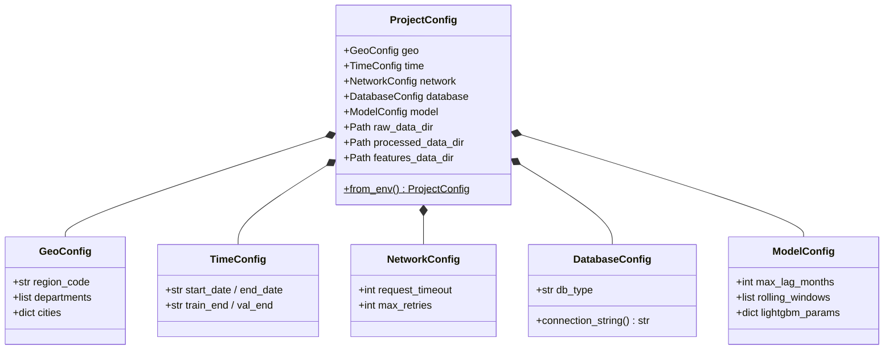

# Pipeline de Donnees — HVAC Market Analysis

> Documentation technique du pipeline ELT complet, de la collecte des sources
> externes jusqu'a la production de modeles ML.

---

## 1. Architecture du pipeline ELT

### 1.1 Diagramme du flux complet

L'orchestrateur central `src/pipeline.py` pilote 10 etapes sequentielles via CLI.


### 1.2 Pattern ELT : justification

| Aspect | ETL classique | ELT (notre choix) |
|--------|--------------|-------------------|
| Ordre | Transform avant Load | Load brut, puis Transform |
| Stockage brut | Non | Oui (`data/raw/`) |
| Rejouabilite | Limitee | Totale (raw conserve) |
| Debug | Difficile | Facile (comparer raw vs processed) |

**Pourquoi ELT ?** Les CSV bruts dans `data/raw/` sont la source de verite. Si une regle
de nettoyage change, on relance `clean` sans re-collecter. Chaque etape est idempotente.
Pour un projet portfolio, la transparence raw/processed est essentielle.

---

## 2. Detail de chaque etape

### 2.1 Collect — Collecte des donnees brutes

| | |
|---|---|
| **Entrees** | APIs externes (Open-Meteo, INSEE, Eurostat, SITADEL, ADEME) |
| **Sorties** | `data/raw/{source}/{source}.csv` |
| **CLI** | `python -m src.pipeline collect` ou `--sources weather,insee` |
| **Temps** | 15-45 min (96 depts, 5 APIs, rate limiting) |
| **Idempotent** | Oui (ecrase le raw precedent) |

| Source | API | Volume | Grain |
|--------|-----|--------|-------|
| weather | Open-Meteo Archive | ~250K lignes | jour x departement |
| insee | INSEE BDM (SDMX) | ~500 lignes | mois (national) |
| eurostat | Eurostat SDMX | ~200 lignes | mois x code NACE |
| sitadel | SITADEL2 | ~5K lignes | mois x departement |
| dpe | ADEME Data Fair | ~1.4M lignes | DPE individuel |

### 2.2-2.3 Init DB + Import Data

| | Init DB | Import Data |
|---|---------|-------------|
| **Sorties** | Schema BDD (tables, index) | Tables peuplees |
| **CLI** | `python -m src.pipeline init_db` | `python -m src.pipeline import_data` |
| **Temps** | < 5 sec | 1-5 min |
| **Idempotent** | Oui (CREATE IF NOT EXISTS) | Oui (deduplication cle primaire) |

### 2.4 Clean — Nettoyage des donnees brutes

| | |
|---|---|
| **Entrees** | `data/raw/{source}/*.csv` |
| **Sorties** | `data/processed/{source}/*.csv` |
| **CLI** | `python -m src.pipeline clean` |
| **Temps** | 30 sec - 2 min |
| **Idempotent** | Oui (lit raw, ecrit processed, deterministe) |


### 2.5 Merge — Fusion multi-sources

| | |
|---|---|
| **Entrees** | `data/processed/` (dpe, weather, insee, eurostat) |
| **Sorties** | `data/features/hvac_ml_dataset.csv` |
| **CLI** | `python -m src.pipeline merge` |
| **Temps** | 30 sec - 1 min |
| **Idempotent** | Oui |


### 2.6 Features — Feature engineering

| | |
|---|---|
| **Entrees** | `data/features/hvac_ml_dataset.csv` |
| **Sorties** | `data/features/hvac_features_dataset.csv` |
| **CLI** | `python -m src.pipeline features` |
| **Temps** | < 30 sec |
| **Idempotent** | Oui |

| Categorie | Exemples | Justification |
|-----------|----------|---------------|
| Lags (1, 3, 6 mois) | `nb_pac_lag_1m` | Auto-correlation |
| Rolling (3, 6 mois) | `nb_pac_rmean_3m` | Lissage, volatilite |
| Variations | `nb_pac_diff_1m` | Acceleration marche |
| Interactions | `interact_hdd_confiance` | Hypotheses metier croisees |
| Tendance | `year_trend`, `delta_temp_vs_mean` | Croissance, anomalies meteo |

### 2.7 Outliers — Detection multi-methode

| | |
|---|---|
| **Entrees** | `data/features/hvac_features_dataset.csv` |
| **Sorties** | Dataset traite (ecrase) + `data/analysis/outlier_report.txt` |
| **CLI** | `python -m src.pipeline outliers` |
| **Temps** | < 30 sec |
| **Idempotent** | Oui |


### 2.8-2.9 Train + Evaluate

| | Train | Evaluate |
|---|-------|---------|
| **Entrees** | Dataset features | Modeles entraines |
| **Sorties** | `data/models/*.pkl` | Figures, rapport, SHAP |
| **CLI** | `python -m src.pipeline train` | `python -m src.pipeline evaluate` |
| **Temps** | 1-5 min | 1-3 min |
| **Idempotent** | Oui (random_state fixe) | Oui |

**Modeles** : Ridge (baseline), LightGBM (principal), Prophet (saisonnalite), LSTM (exploratoire).
**Split temporel** : Train 2021-07/2024-06 | Val 2024-07/2024-12 | Test 2025-01/2025-12.

### 2.10 Commandes composites

| Commande | Etapes | Usage |
|----------|--------|-------|
| `process` | clean + merge + features + outliers | Retraitement complet |
| `all` | init_db + collect + import + process + eda + train + evaluate | Pipeline bout en bout |
| `update_all` | collect + init_db + import + process + eda + train + evaluate + upload | Mise a jour + cloud |

---

## 3. Modularite et reproductibilite

### 3.1 Configuration centralisee

`config/settings.py` utilise des **dataclasses immuables** (`frozen=True`). Aucun chemin en dur.



### 3.2 Variables d'environnement (.env)

| Variable | Defaut | Description |
|----------|--------|-------------|
| `TARGET_REGION` | `FR` | `FR` = 96 depts, `84` = AURA |
| `TARGET_DEPARTMENTS` | (vide) | Override : `69,38,42` |
| `DATA_START_DATE` | `2019-01-01` | Debut collecte |
| `DB_TYPE` | `sqlite` | `sqlite`, `mssql`, `postgresql` |
| `REQUEST_TIMEOUT` | `30` | Timeout HTTP (sec) |
| `MAX_RETRIES` | `3` | Retries reseau |
| `RAW_DATA_DIR` | `data/raw` | Repertoire brut |
| `LOG_LEVEL` | `INFO` | Niveau logging |

### 3.3 Architecture plugin des collecteurs


**Ajout d'une source** : creer un fichier dans `src/collectors/`, heriter de `BaseCollector`,
implementer `collect()` et `validate()`. L'auto-enregistrement via `__init_subclass__` rend la
source disponible sans modifier aucun fichier existant.

---

## 4. Logs structures

### 4.1 Format et niveaux

```
%(asctime)s | %(name)-25s | %(levelname)-8s | %(message)s
```

| Niveau | Usage |
|--------|-------|
| `DEBUG` | Requetes HTTP, URLs, parametres internes |
| `INFO` | Demarrage/fin d'etape, volumes, chemins de sortie |
| `WARNING` | Fichier manquant (non bloquant), NaN restants |
| `ERROR` | Echec collecte, dataset vide, source introuvable |

### 4.2 Exemple de sortie (run complet)

```
2026-02-21 14:30:00 | pipeline                  | INFO     | ============================================================
2026-02-21 14:30:00 | pipeline                  | INFO     |   HVAC Market Analysis — Pipeline
2026-02-21 14:30:00 | pipeline                  | INFO     |   Etape : all
2026-02-21 14:30:00 | pipeline                  | INFO     | ============================================================
2026-02-21 14:30:01 | collectors.weather        | INFO     |   COLLECTE : WEATHER
2026-02-21 14:30:01 | collectors.weather        | INFO     |   Periode  : 2019-01-01 -> 2026-02-28
2026-02-21 14:35:24 | collectors.weather        | INFO     | Collecte reussie : 254016 lignes
...
2026-02-21 14:48:00 | processing.clean          | INFO     |   PHASE 2.1 — Nettoyage des donnees brutes
2026-02-21 14:48:01 | processing.clean          | INFO     |   Lignes brutes : 254016
2026-02-21 14:48:02 | processing.clean          | INFO     |   Meteo nettoyee : 254016 -> 254016 lignes
...
2026-02-21 14:52:00 | processing.merge          | INFO     | Dataset ML : 4032 lignes x 35 colonnes
2026-02-21 14:52:30 | processing.features       | INFO     | Features ajoutees : 52 nouvelles colonnes
2026-02-21 14:53:00 | processing.outliers       | INFO     | Winsorization : 127 valeurs clippees
...
2026-02-21 14:58:00 | models.train              | INFO     | Phase 4 terminee : 4 modeles entraines.
2026-02-21 15:01:00 | models.evaluate           | INFO     | Phase 4 (evaluate) terminee.
2026-02-21 15:01:00 | pipeline                  | INFO     | Pipeline termine.
```

---

## 5. Alternative Airbyte

### 5.1 Mapping des sources vers Airbyte

| Source | Collecteur custom | Connecteur Airbyte |
|--------|-------------------|-------------------|
| Open-Meteo | `WeatherCollector` | HTTP API Source (generique) |
| INSEE BDM | `InseeCollector` | HTTP API Source (SDMX/XML) |
| Eurostat | `EurostatCollector` | HTTP API Source (SDMX) |
| SITADEL | `SitadelCollector` | HTTP API Source ou File Source |
| ADEME DPE | `DpeCollector` | HTTP API Source (paginee, a configurer) |

### 5.2 Architecture alternative


### 5.3 Comparaison

| Critere | Collecteurs custom | Airbyte |
|---------|-------------------|---------|
| **Controle** | Total (Python) | Config UI/YAML |
| **Complexite** | Faible (pip install) | Moyenne (Docker) |
| **Maintenance** | Manuelle (si API change) | Communaute |
| **Monitoring** | Logs custom | Interface web native |
| **Scheduling** | Cron manuel | Natif |
| **Incremental sync** | A implementer | Natif (CDC) |
| **Portfolio** | Demontre Python | Demontre Data Eng |

**Recommandation** : pour un projet portfolio Data Analyst, les collecteurs custom sont
preferes car ils demontrent la maitrise Python, la gestion d'erreurs et la conception
d'architecture extensible. Airbyte serait pertinent en production avec plus de volume.

---

## 6. Monitoring et alerting

### 6.1 Trois axes de surveillance


### 6.2 Seuils d'alerte recommandes

| Metrique | WARNING | CRITICAL |
|----------|---------|----------|
| Age donnees raw | > 7 jours | > 30 jours |
| Lignes meteo (raw) | < 200 000 | < 100 000 |
| Lignes DPE (raw) | < 500 000 | < 100 000 |
| Lignes dataset ML | < 2 000 | < 500 |
| Departements dans ML | < 90 | < 50 |
| Taux NaN (cible) | > 5% | > 20% |
| Taux NaN (features) | > 15% | > 40% |
| Outliers consensus | > 10% | > 25% |
| R2 meilleur modele | < 0.5 | < 0.2 |
| MAPE meilleur modele | > 30% | > 50% |
| Duree run complet | > 60 min | > 120 min |
| Collecteurs en echec | 1 source | >= 3 sources |

### 6.3 Outils complementaires envisageables

| Outil | Usage | Complexite |
|-------|-------|-----------|
| **Great Expectations** | Tests qualite donnees automatises | Moyenne |
| **Soda Core** | Verification qualite (SodaCL) | Faible |
| **Prometheus + Grafana** | Monitoring temps reel | Elevee |
| **dbt tests** | Tests integres aux transformations SQL | Faible |

---

*Pipeline orchestre par `src/pipeline.py` — CLI : `python -m src.pipeline <etape>`*
